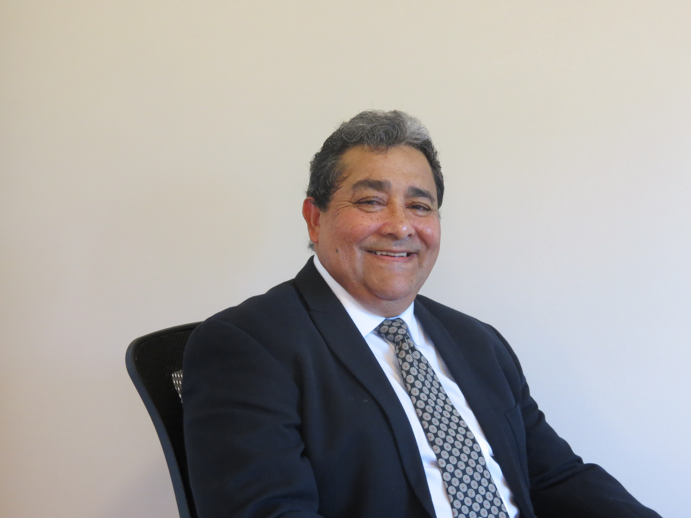

# CURRÍCULUM VITAE ABREVIADO
 
## Nombre: Albán Rosales Ibarra
 
## Título: Ing. Agrónomo
 
## Postgrado: Maestría Extensión Agrícola
 
## Especialidades:
 - Mapeo digital de suelos
 - Zonificación Agroecológica
 - Estudios de suelos:
        - Estudios detallados y semidetallados de suelos
        - Estudios de Uso Conforme del suelo
            - Informaciones posesorias
            - Segregación de fincas
            - Explotación de áridos
            - Cambios de uso del suelo
            
# Proyectos publicados en la web:
[Proyecto ZAE Los Santos] (http://www.mag.go.cr/bibliotecavirtual/E11-11093.PDF)

[Proyecto ZAE Cantón Alvarado] (http://www.mag.go.cr/bibliotecavirtual/E11-11092.PDF)
    
    - Proyecto ZAE Canton Naranjo
    - Proyecto ZAE Cantón Puriscal (Zona Norte)

## Foto: 
 
 
 

 
# Email: albanrosales@hotmail.com

